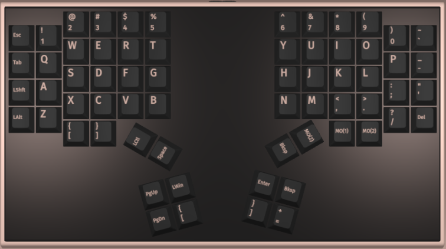
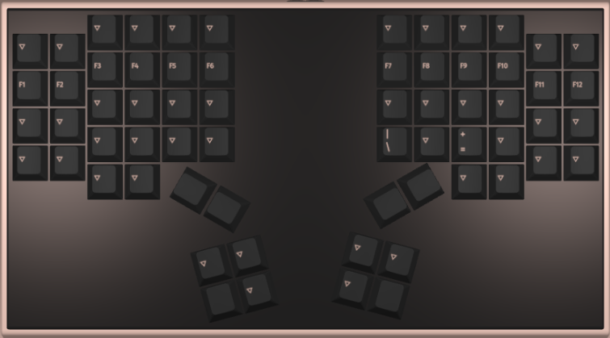
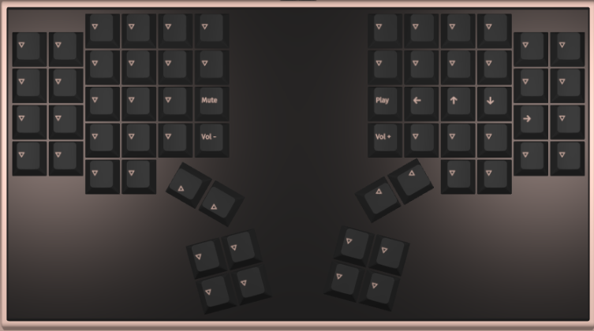

# The Dactyl-ManuForm Keyboard
This is my fork of the [dactyl-manuform](https://github.com/abstracthat/dactyl-manuform) keyboard project.

## The case/plate
I built the case and plate using the [Dactyl Manuform Configurator](https://ryanis.cool/dactyl) from [rianadon](https://github.com/rianadon). If you want to customize your own using mine as a starting point, you can use [my config url](https://ryanis.cool/dactyl/#manuform:ChwIBhAFGgNzaXgiA3R3byoCbXgyBm5vcm1pZTgAIhdVAACAQBgAIAFdAADgQGUAAEBAQAFIAA==). My files are under the print folder on this repo.

## Keymap layers

### Layer 0 — Base (QWERTY)

### Layer 1 — Function Keys & Navigation

### Layer 2 — Media Controls

## Final keeb
The keyboard was built by @duMagnus and can be viewed in the following [Instagram post](https://www.instagram.com/reel/DXN6CNUk-t5/?utm_source=ig_web_copy_link&igsh=MzRlODBiNWFlZA==)
The firmware related files can be found on this [repo](https://github.com/duMagnus/qmk_firmware/tree/fdb7822f8dab668a68bfa80adbcf0c37e3f8dd95/keyboards/handwired/magnuskeebs/dactyl_manuform_gabriel)
