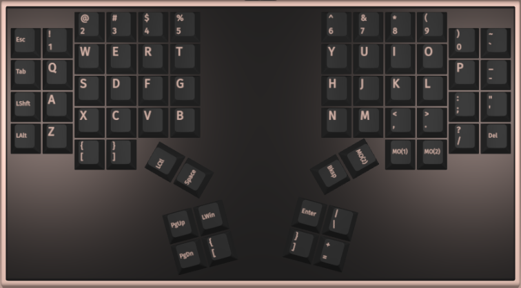
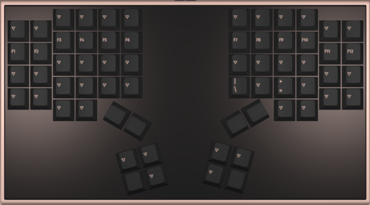
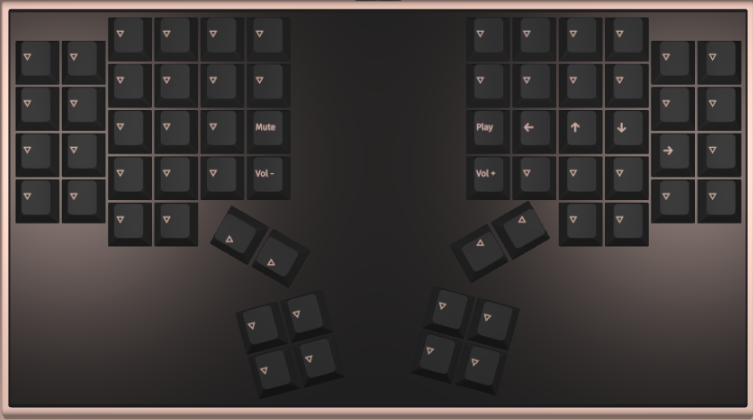

# The Dactyl-ManuForm Keyboard
This is my fork of the [dactyl-manuform](https://github.com/abstracthat/dactyl-manuform) keyboard project.

## The case/plate
I built the case and plate using the [Dactyl Manuform Configurator](https://ryanis.cool/dactyl) from [rianadon](https://github.com/rianadon). If you want to customize your own using mine as a starting point, you can use [my config url](https://ryanis.cool/dactyl/#manuform:ChwIBhAFGgNzaXgiA3R3byoCbXgyBm5vcm1pZTgAIhdVAACAQBgAIAFdAADgQGUAAEBAQAFIAA==). My files are under the print folder on this repo.

## Using VIA

The keyboard is a handwired build, so it is not in VIA's remote definition database. Opening
[usevia.app](https://usevia.app/) without sideloading the definition first gives:

> VIA could not find a V3 definition for Dactyl Manuform (Handwired). VID: 0x4D41 | PID: 0x0002

Fix it once per browser profile:

1. Open [usevia.app](https://usevia.app/) and go to the **Design** tab (the gear/cog icon).
2. Drag `via_definition.json` from this repo onto the upload area.
3. Go back to the **Configure** tab and click **Authorize device**, then pick
   *Dactyl Manuform (Handwired)*.

Sideloading only teaches the browser what the keyboard looks like — it does not write anything to
the board, so the keymap already flashed on it stays untouched.

### Files

| File | What it is | Where it goes in VIA |
|:--|:--|:--|
| `via_definition.json` | V3 keyboard definition — matrix size and physical key layout | **Design** tab |
| `dactyl_via.json` | Keymap backup — the 4 layers and the macros | **Save + Load** tab |

`dactyl_via.json` is only needed to *restore* a keymap. Loading it overwrites whatever is on the
board, so don't load it unless that is what you want.

## Keymap

Read from the keyboard itself over VIA's raw HID interface, so the tables below are what is
actually flashed. `▽` is transparent (falls through to the layer underneath) and `—` is unmapped.

Column labels run outer-to-inner on the left half (`L1` = pinky column) and inner-to-outer on the
right half (`R1` = index column). On the thumb clusters, *Near* is the two-key pair tucked against
the main grid and *Far* is the four-key cluster below it.

### Layer 0 — Base (QWERTY)

| Row | L1 | L2 | L3 | L4 | L5 | L6 | R1 | R2 | R3 | R4 | R5 | R6 |
|:--|:--:|:--:|:--:|:--:|:--:|:--:|:--:|:--:|:--:|:--:|:--:|:--:|
| Numbers | ESC | 1 | 2 | 3 | 4 | 5 | 6 | 7 | 8 | 9 | 0 | GRV |
| Upper | TAB | Q | W | E | R | T | Y | U | I | O | P | MINS |
| Home | LSFT | A | S | D | F | G | H | J | K | L | SCLN | QUOT |
| Lower | LALT | Z | X | C | V | B | N | M | COMM | DOT | SLSH | DEL |
| Bottom |  |  | MO(2) | MO(1) |  |  |  |  | MO(1) | MO(2) |  |  |

| Thumb | Near 1 | Near 2 | Far 1 | Far 2 | Far 3 | Far 4 |
|:--|:--:|:--:|:--:|:--:|:--:|:--:|
| Left | LCTL | SPC | PGUP | LGUI | PGDN | LBRC |
| Right | MO(2) | BSPC | ENT | BSLS | RBRC | EQL |

### Layer 1 — Function keys & macros

Held with `MO(1)`.

| Row | L1 | L2 | L3 | L4 | L5 | L6 | R1 | R2 | R3 | R4 | R5 | R6 |
|:--|:--:|:--:|:--:|:--:|:--:|:--:|:--:|:--:|:--:|:--:|:--:|:--:|
| Numbers | ▽ | ▽ | ▽ | ▽ | ▽ | ▽ | ▽ | ▽ | ▽ | ▽ | ▽ | ▽ |
| Upper | F1 | F2 | F3 | F4 | F5 | F6 | F7 | F8 | F9 | F10 | F11 | F12 |
| Home | ▽ | ▽ | ▽ | ▽ | ▽ | ▽ | MACRO(0) | ▽ | ▽ | ▽ | MACRO(1) | ▽ |
| Lower | ▽ | ▽ | ▽ | ▽ | ▽ | ▽ | ▽ | ▽ | ▽ | ▽ | ▽ | ▽ |
| Bottom |  |  | ▽ | ▽ |  |  |  |  | ▽ | ▽ |  |  |

| Thumb | Near 1 | Near 2 | Far 1 | Far 2 | Far 3 | Far 4 |
|:--|:--:|:--:|:--:|:--:|:--:|:--:|
| Left | — | — | ▽ | ▽ | — | ▽ |
| Right | — | — | ▽ | ▽ | ▽ | — |

### Layer 2 — Navigation & media

Held with `MO(2)`.

| Row | L1 | L2 | L3 | L4 | L5 | L6 | R1 | R2 | R3 | R4 | R5 | R6 |
|:--|:--:|:--:|:--:|:--:|:--:|:--:|:--:|:--:|:--:|:--:|:--:|:--:|
| Numbers | ▽ | ▽ | ▽ | ▽ | ▽ | ▽ | ▽ | ▽ | ▽ | ▽ | ▽ | ▽ |
| Upper | ▽ | ▽ | ▽ | ▽ | ▽ | ▽ | ▽ | ▽ | ▽ | ▽ | ▽ | ▽ |
| Home | ▽ | ▽ | RALT | ▽ | ▽ | MUTE | LEFT | DOWN | UP | RGHT | ▽ | ▽ |
| Lower | ▽ | ▽ | ▽ | ▽ | ▽ | VOLD | VOLU | ▽ | ▽ | ▽ | ▽ | ▽ |
| Bottom |  |  | ▽ | ▽ |  |  |  |  | ▽ | ▽ |  |  |

| Thumb | Near 1 | Near 2 | Far 1 | Far 2 | Far 3 | Far 4 |
|:--|:--:|:--:|:--:|:--:|:--:|:--:|
| Left | LCTL | SPC | ▽ | ▽ | ▽ | ▽ |
| Right | ▽ | ▽ | ▽ | ▽ | ▽ | ▽ |

### Layer 3 — Reserved

Reached only by holding both layer keys; currently unmapped apart from the two layer keys themselves.

| Row | L1 | L2 | L3 | L4 | L5 | L6 | R1 | R2 | R3 | R4 | R5 | R6 |
|:--|:--:|:--:|:--:|:--:|:--:|:--:|:--:|:--:|:--:|:--:|:--:|:--:|
| Numbers | — | — | — | — | — | — | — | — | — | — | — | — |
| Upper | — | — | — | — | — | — | — | — | — | — | — | — |
| Home | — | — | — | — | — | — | — | — | — | — | — | — |
| Lower | — | — | — | — | — | — | — | — | — | — | — | — |
| Bottom |  |  | — | — |  |  |  |  | — | — |  |  |

| Thumb | Near 1 | Near 2 | Far 1 | Far 2 | Far 3 | Far 4 |
|:--|:--:|:--:|:--:|:--:|:--:|:--:|
| Left | — | — | — | — | — | MO(1) |
| Right | — | — | — | — | MO(2) | — |

### Macros

| Slot | Contents | Effect |
|:--|:--|:--|
| `MACRO(0)` | `{+KC_F3}` `{+KC_T}` `{-KC_F3}` `{-KC_T}` | Holds F3+T together, then releases both |
| `MACRO(1)` | `{+KC_F3}` `{+KC_P}` `{-KC_F3}` `{-KC_P}` | Holds F3+P together, then releases both |

Both are stored with literal newlines between the steps, which is how VIA's macro editor saves a
multi-line macro.

### Screenshots

> **Note:** these VIA screenshots predate the current keymap. The tables above are authoritative.
> Differences: the left bottom-row pair is now `MO(2)`/`MO(1)` instead of `[`/`]`, layer 1 gained
> the two macros, and layer 2 gained `RAlt`, `LCtl` and `Space`.

## Final keeb
The keyboard was built by @duMagnus and can be viewed in the following [Instagram post](https://www.instagram.com/reel/DXN6CNUk-t5/?utm_source=ig_web_copy_link&igsh=MzRlODBiNWFlZA==)
The firmware related files can be found on this [repo](https://github.com/duMagnus/qmk_firmware/tree/fdb7822f8dab668a68bfa80adbcf0c37e3f8dd95/keyboards/handwired/magnuskeebs/dactyl_manuform_gabriel)
